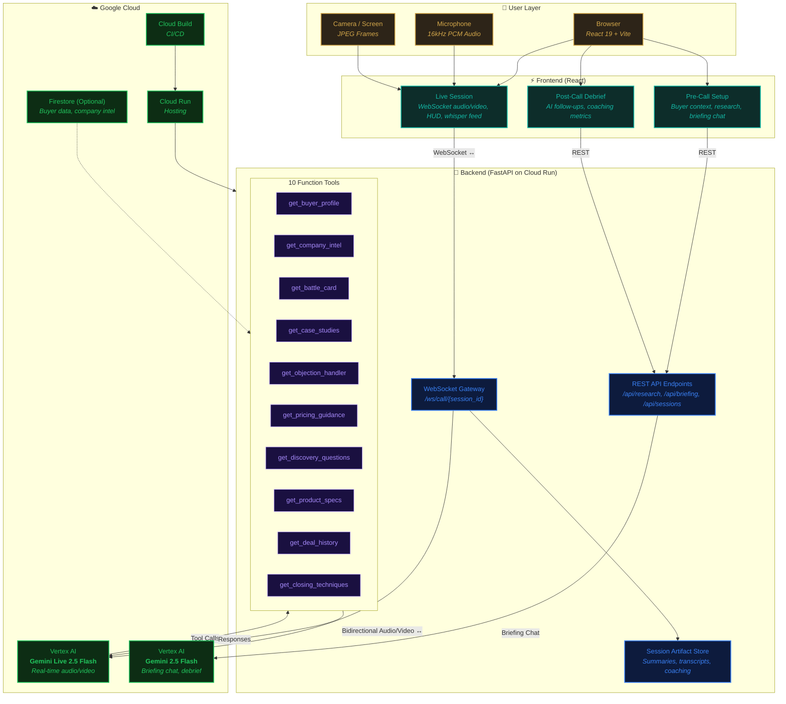

# DealWhisper Architecture

## System Architecture Diagram

## Data Flow Summary

| Flow | Protocol | Path | Purpose |
|------|----------|------|---------|
| Live Audio/Video | WebSocket | Browser → FastAPI → Gemini Live 2.5 Flash | Real-time call coaching |
| Briefing Chat | REST/HTTP | Browser → FastAPI → Gemini 2.5 Flash | Pre-call preparation |
| Tool Calls | gRPC/HTTP | Gemini → FastAPI Tools → Gemini | Dynamic context retrieval |
| Artifacts | Internal | FastAPI → Artifact Store | Session persistence |

## Key Components

- **Gemini Live 2.5 Flash**: Powers real-time multimodal streaming (audio + video) during live sales calls
- **Gemini 2.5 Flash**: Handles pre-call briefing chat and post-call debrief generation
- **10 Function Tools**: Provide Gemini with real-time access to buyer profiles, battle cards, case studies, objection handlers, pricing guidance, and more
- **WebSocket Gateway**: Bidirectional relay between browser and Gemini Live API for low-latency streaming
- **Session Artifact Store**: Persists call summaries, transcripts, and coaching metrics
